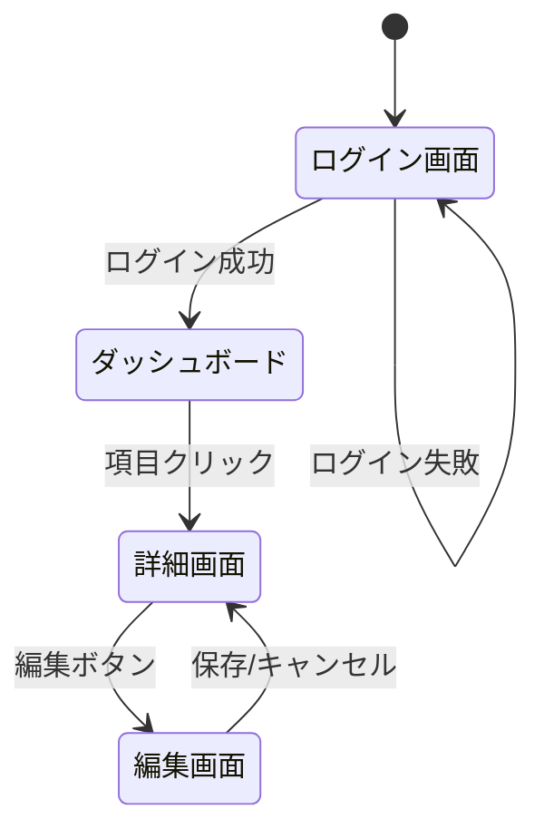

# 画面仕様・ワイヤーフレーム定義

## Overview

UI要件を構造化し、画面遷移図と各画面の仕様書を作成する。
Mermaidでの簡易図とdraw.ioでのリッチな図の両方に対応し、Next.js App Routerの規約に沿ったURL設計と既存デザインシステムとの接続を意識した仕様を生成する。

## The Process

### Phase 1: 画面の全体像を把握

まず対象となる機能の全体像を掴む:

1. 関連ドキュメントを確認:
   - `docs/requirements/` のPRD
   - `docs/stories/` のユーザーストーリー
   - 既存の `src/app/` 配下のページ構成
2. ユーザーに質問: 「どの機能の画面を設計しますか？」
3. 必要な画面を洗い出し、一覧として提示:

```
1. {画面名} - {概要}
2. {画面名} - {概要}
3. ...
```

4. 「この画面一覧で合っていますか？追加・削除はありますか？」と確認

### Phase 2: 画面遷移図の作成

画面間のナビゲーションを図にする。遷移図がないまま個別画面の設計に入ると、画面間の整合性が崩れやすくなるため、ここで全体の流れを先に合意する。

**図の形式を選択:**

ユーザーに確認する:
- **Mermaid図**（デフォルト）: Markdownに埋め込めてGitHub上で直接閲覧可能。`references/mermaid-patterns.md` を参照
- **draw.io図**: よりリッチなビジュアル表現が必要な場合。`drawio` スキルを使って `.drawio` ファイルを生成。ステークホルダー向けの共有資料として見栄えが良い

**手順:**
1. 画面間のナビゲーションを図で描く
2. ユーザーアクション（クリック、フォーム送信等）をエッジラベルに記載
3. 分岐（認証状態、権限等）があれば条件を明示
4. 図を提示し、フィードバックを受けて修正

**Mermaid図の例:**


遷移図が確定するまでこのフェーズに留まる。

### Phase 3: 各画面の仕様定義

画面を **1つずつ** 定義し、各画面ごとに確認を取る。全画面を一気に設計しようとすると見落としが増えるため、1画面ずつ確認サイクルを回す。

**各画面で定義する項目:**

1. **画面名とURL**: Next.js App Router準拠のパス
   - 例: `/dashboard` → `src/app/dashboard/page.tsx`
2. **画面の目的**: この画面で達成すること（1-2文）
3. **表示要素**: ヘッダー、コンテンツ、サイドバー等の構成
4. **インタラクション**: ボタン、フォーム、モーダル等の操作
5. **状態バリエーション**: ユーザーが実際に遭遇する各状態を考慮する。これを設計段階で決めておかないと、実装時に「データがないときどうする？」という判断がエンジニア任せになり、UXの一貫性が崩れる
   - Empty State: データがない場合の表示
   - Loading State: 読み込み中の表示
   - Error State: エラー時の表示
   - Populated State: データがある場合の通常表示
6. **レスポンシブ挙動**: モバイル/タブレット/デスクトップでの違い

**テキストベースのワイヤーフレーム記法:**
```
┌─────────────────────────────────┐
│ ヘッダー [ロゴ] [ナビ] [ユーザー] │
├─────────────────────────────────┤
│ サイドバー │ メインコンテンツ       │
│            │                      │
│ [メニュー]  │ [タイトル]           │
│ [メニュー]  │ [コンテンツエリア]    │
│            │ [アクションボタン]     │
├─────────────────────────────────┤
│ フッター                         │
└─────────────────────────────────┘
```

**draw.ioワイヤーフレーム（オプション）:**
テキストベースでは伝えきれない複雑なレイアウトの場合は、`drawio` スキルを使ってビジュアルなワイヤーフレームを作成できる。ユーザーに必要か確認してから作成する。
- 保存先: `docs/screens/` に `.drawio` または `.drawio.png` で配置
- draw.ioの利点: レイアウトの位置関係やサイズ感がテキストよりも正確に伝わる

### Phase 4: デザインシステムとの接続

既存のUIコンポーネントと画面要素をマッピングする。新規コンポーネントの作成は既存で賄えない場合に限る。既存コンポーネントの再利用はUIの一貫性を保ち、実装コストも下がるため、常に優先する。

**手順:**
1. `src/components/ui/` の既存コンポーネントを確認
2. 各画面の表示要素を既存コンポーネントにマッピング:

| 画面要素 | 使用コンポーネント | カスタマイズ |
|---------|-------------------|-------------|
| {要素} | `<Button>` | variant="primary" |
| {要素} | `<Card>` | - |
| {要素} | 新規作成が必要 | {理由} |

3. 新規コンポーネントが必要な場合はフラグ
4. `manage-agent-native-design-system` スキルへの引き継ぎ情報を整理

### Phase 5: 仕様書の出力

全画面の仕様が確定したら、仕様書を生成する。

**出力フォーマット:**
```markdown
# 画面仕様書: {機能名}

## 画面遷移図
{Mermaid図 または draw.ioファイルへの参照}

## 画面一覧
| 画面名 | URL | 概要 |
|--------|-----|------|

## 画面詳細

### {画面名}
- **URL**: {パス}
- **目的**: {目的}
- **ワイヤーフレーム**: {テキストベースワイヤーフレーム}
- **表示要素**: {要素一覧}
- **インタラクション**: {操作一覧}
- **状態バリエーション**: {各状態}
- **使用コンポーネント**: {コンポーネント一覧}
```

**保存先:** `docs/screens/YYYY-MM-DD-<feature-name>-screens.md`

**次のステップを提案:**
- 「画面を実装しますか？」→ `frontend-design` スキル
- 「影響分析を行いますか？」→ `impact-analysis` スキル
- 「実装計画を立てますか？」→ `writing-plans` スキル

## Key Principles

- **1画面ずつ定義** — 全画面を一気に設計すると、個々の画面の詳細が雑になりがち。1画面ずつ確認を取ることで精度を上げる
- **遷移図を先に確定** — 個別画面の前に全体の流れを合意する。後から「この画面からあの画面にも行けるべきだった」と気づくと手戻りが大きい
- **4つの状態を考慮** — Empty/Loading/Error/Populated は実装時に必ず必要になる。設計段階で決めておくと、エンジニアとの認識合わせがスムーズになる
- **既存コンポーネントを優先** — 一から設計すると見た目のバラつきが出て、結果的にユーザー体験が損なわれる。Shadcn/UIの既存コンポーネントで足りないか先に検討する
- **App Router規約に従う** — URLパスとファイル配置を一致させることで、仕様書を読んだエンジニアが迷わず実装に着手できる

## Common Mistakes

- 画面遷移図を省略していきなり個別画面の設計に入る
- Empty StateやError Stateを考慮し忘れる
- 既存のデザインシステムを無視して一から設計する
- モバイル/レスポンシブ対応を後回しにする
- URLパスの設計をファイル構造と合わせない
