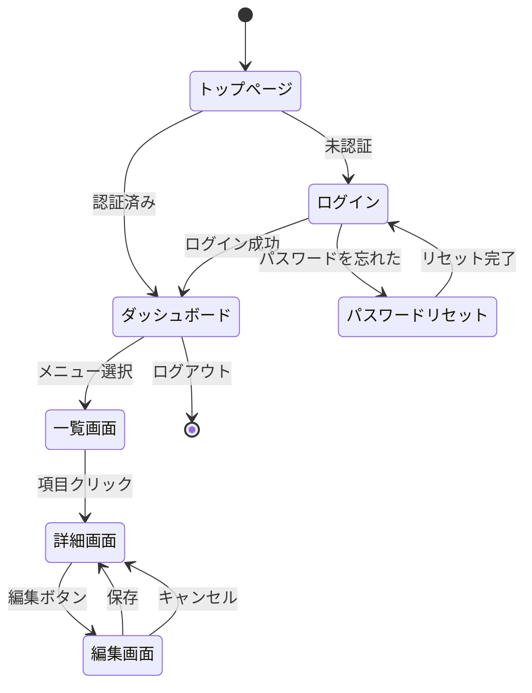
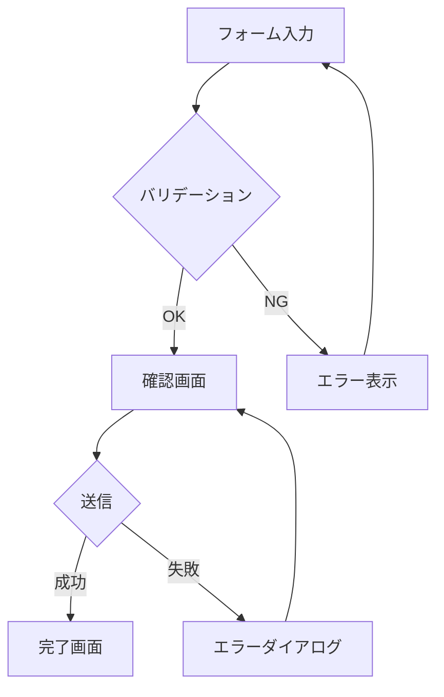
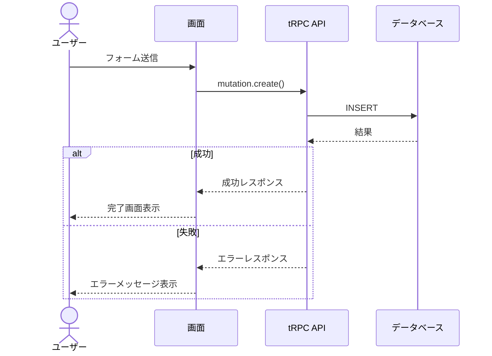
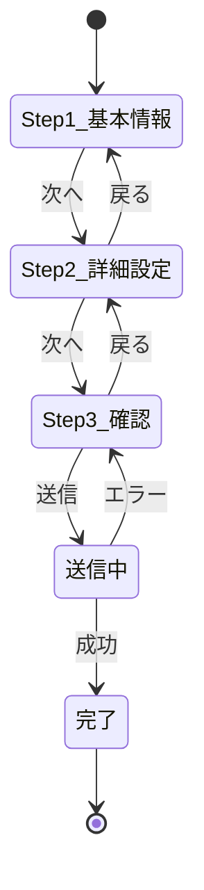
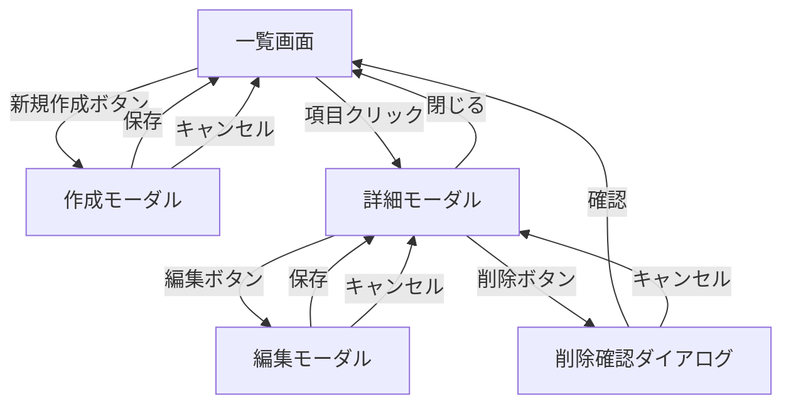

# Mermaid図パターン集

画面仕様書で使用するMermaid図のパターン。用途に応じて適切なパターンを選択する。

---

## 1. 画面遷移図（stateDiagram-v2）

画面間のナビゲーションを表現する基本パターン。

**使いどころ:** 画面全体の遷移を俯瞰する場合

---

## 2. ユーザーフロー図（flowchart）

分岐やエラーパスを含むユーザーフローの表現。

**使いどころ:** 特定の操作フローを詳細に描く場合。分岐やエラー処理が複雑な場合に特に有効。

---

## 3. API連携図（sequence diagram）

画面とバックエンドの通信フロー。

**使いどころ:** フロントエンドとバックエンドの連携を明確にする場合。tRPCのprocedure設計の参考になる。

---

## 4. フォーム/ウィザード状態図

複数ステップのフォームやウィザードの状態遷移。

**使いどころ:** 多段階の入力フローがある場合。

---

## 5. モーダル/ダイアログフロー

メイン画面とモーダルの関係を表現。

**使いどころ:** SPA的なUIでモーダル/ダイアログが多用される場合。

---

## Next.js App Router パス命名規則

画面名からURLパスとファイル配置を導出する規則:

| 画面名 | URLパス | ファイル配置 |
|--------|---------|-------------|
| トップページ | `/` | `src/app/page.tsx` |
| ダッシュボード | `/dashboard` | `src/app/dashboard/page.tsx` |
| ユーザー一覧 | `/users` | `src/app/users/page.tsx` |
| ユーザー詳細 | `/users/[id]` | `src/app/users/[id]/page.tsx` |
| ユーザー編集 | `/users/[id]/edit` | `src/app/users/[id]/edit/page.tsx` |
| 設定画面 | `/settings` | `src/app/settings/page.tsx` |
| 設定(タブ) | `/settings/[tab]` | `src/app/settings/[tab]/page.tsx` |

**命名ルール:**
- URLは kebab-case（例: `/user-profile`）
- 動的パラメータは `[param]` で表現
- レイアウト共有は `layout.tsx` で管理
- ローディングは `loading.tsx`、エラーは `error.tsx` で管理
