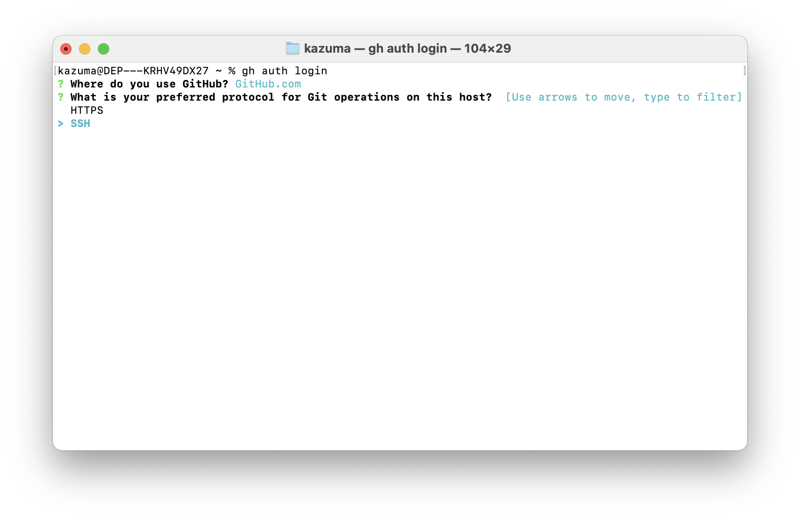

# construct-pro-next

株式会社WIN WIN様 社内業務管理システムの Next.js/tRPC 全面書き換え版。

## What is this?

現行の construct-pro（Express + 素のHTML/JS + PostgreSQL、`~/construct-pro` で本番稼働中）を、Next.js(TypeScript) + tRPC + Drizzle + shadcn/ui のスタックに書き換えたもの。同一のSupabase Postgresインスタンスに接続し、データ移行は行わない。

移行計画の全体像は `/Users/hiromu.umeda/.claude/plans/mutable-gliding-metcalfe.md` を参照。

このテンプレート自体は [T3 Stack](https://create.t3.gg/) をベースに、Claude Code / Codex / Cursor / GitHub Copilot のすべてに対応する形でコーディングAIエージェント向けスキルを設定した Sun* Next.js Dev Template を元にしている。

## Features

### プリインストールされたTech Stack

- **[Next.js](https://nextjs.org)** - フルスタックReactフレームワーク
  - App Router、SSR/SSG、API Routesを統合したモダンなWeb開発環境
  - ファイルベースルーティングと自動画像最適化

- **[TypeScript](https://www.typescriptlang.org)** - 型安全なJavaScript
  - 静的型チェックによる開発時のエラー検出と IDE支援
  - 大規模開発での保守性とチーム開発効率の向上

- **[Tailwind CSS](https://tailwindcss.com)** - ユーティリティファーストCSSフレームワーク
  - 事前定義されたクラスによる高速なUIスタイリング
  - レスポンシブデザインとデザインシステムの一貫性

- **[tRPC](https://trpc.io)** - End-to-End型安全なAPI通信
  - サーバーからクライアントまで完全な型安全性を実現
  - React QueryベースのReactフックとZodスキーマ検証

- **[Biome](https://biomejs.dev/ja/)** - 高速Linter & Formatter
  - ESLint + Prettierの代替として10-100倍高速（Rust製）
  - コードフォーマットとリンティングを統合、Tailwind CSSクラス名ソート機能付き

- **[Zod](https://zod.dev)** - TypeScript-firstスキーマ検証
  - スキーマから自動的にTypeScript型を生成
  - APIの入出力データの実行時型安全性とバリデーション

- **[Lefthook](https://github.com/evilmartians/lefthook)** - 軽量Gitフック管理
  - コミット時の自動コードフォーマットと品質チェック
  - 高速実行（Go製）と並列タスク処理

- **[Vitest](https://vitest.dev)** - 高速ユニットテストフレームワーク
  - Viteベースの瞬時テスト実行とHMRサポート
  - Jest互換APIとネイティブTypeScriptサポート

- **[Playwright](https://playwright.dev)** - モダンE2Eテストフレームワーク
  - Chromium、Firefox、Safariでの並列実ブラウザテスト
  - 強力なデバッグツールとCI/CD統合

- **[Shadcn/UI](https://ui.shadcn.com)** - カスタマイズ可能UIコンポーネント
  - Copy & Paste方式で完全にカスタマイズ可能
  - Radix UI基盤でアクセシビリティ対応とTailwind CSS統合

**アーキテクチャの特徴**: TypeScript + Next.js + tRPCによるフルスタック型安全性、高速開発ツールチェーン、包括的テスト環境

### プロジェクトに合わせた自由度

- **認証** - 要件に合わせて認証機構を差し替え可能（Auth.js、Clerk、Supabase Auth など）
- **インフラ** - Vercelなら環境変数設定のみでデプロイ可能。Vercel以外でもNext.jsが動く環境（Cloudflare Workers、Cloud Run など）ならフロント/バックエンドを簡単にデプロイ可能
- **DB** - Postgres / MySQL / SQLite など、プロジェクト要件に合わせて選択可能（Vercel利用時はSupabaseが便利）
- **ORM** - Prisma / Drizzle など、要件に合わせて選択可能

### デザインシステム

このテンプレートには、**Tokens / Components / Skills** の3層で構成されたAgent-Native Design Systemが組み込まれています。

参考資料: [https://note.com/kazuma_endo/n/ncce4bdfa4a0a](https://note.com/kazuma_endo/n/ncce4bdfa4a0a)

#### デザインシステムの構成
- **Tokens（globals.cssのデザイントークン）** - カラー、タイポグラフィ、スペーシングなどのCSS変数
- **Components（Shadcn/UIコンポーネント）** - 再利用可能なUIコンポーネントライブラリ（Button、Card、Input など）
- **Skills（エージェントスキル）** - `manage-agent-native-design-system` のスキルファイルを作成・インストール済みで、トークンとコンポーネントの運用を支援
- この3つの組み合わせにより、一貫性のあるデザインを実現

#### tweakcnによるGUIベースのスタイリング

[tweakcn](https://tweakcn.com/)を使用することで、デザイナーがコードを書かずにGUI上でデザイントークンを視覚的に調整できます。

**ワークフロー**:
1. **tweakcnでカスタマイズ** - カラー、タイポグラフィ、スペーシングをGUIで視覚的に調整
2. **globals.cssに貼り付け** - エクスポートされたCSSを`src/styles/globals.css`にコピー
3. **即座に反映** - Shadcn/UIコンポーネントがデザイントークンを参照しているため、アプリ全体のデザインが自動更新

詳細は `/design-system` ページで確認できます。

### ディレクトリ構造

```
nextjs-dev-template/
├── __tests__/            # ユニットテストファイル
├── .claude/              # Claude Code設定（コマンド、エージェント、スキル）
├── .github/              # GitHub関連設定
│   ├── workflows/        # GitHub Actions CI/CD設定
│   └── dependabot.yml    # Dependabot設定
├── docs/                 # プロジェクト文書
├── e2e/                  # E2Eテストファイル
├── public/               # 静的ファイル
├── src/
│   ├── app/              # Next.js App Router
│   ├── components/       # 再利用可能なUIコンポーネント
│   ├── lib/              # ユーティリティ関数
│   ├── server/           # サーバーサイドロジック
│   ├── styles/           # グローバルスタイル
│   └── trpc/             # tRPC設定
└── ...                   # 各種設定ファイル
```

## Usage

### 1. 前提条件のインストール

```bash
curl -fsSL https://bun.sh/install | bash
```

GitHub CLI（必須：カスタムコマンドで使用）。macOS は Homebrew 経由、その他のOSは[公式ページ](https://cli.github.com/)を参照。

```bash
brew install gh
```

```bash
gh auth login
```

> **重要**: `gh auth login` で「What is your preferred protocol?」と聞かれたら、**必ず「SSH」を選択**してください。
>
> 

### 2. SSH鍵のSSO認証（初回のみ）

このリポジトリは Sun* の GitHub 組織（`sun-asterisk-internal`）にあるため、SSH経由でアクセスするにはSSH鍵のSSO認証が必要です。

> **重要**: このリポジトリを利用（clone）するには、事前に情シスへ申請して GitHub の `sun-asterisk-internal` Organization へ参加している必要があります。

1. GitHub の [SSH Keys 設定ページ](https://github.com/settings/keys) を開く
2. 使用するSSH鍵の横にある **「Configure SSO」** をクリック
3. **「sun-asterisk-internal」** の **「Authorize」** ボタンをクリック

### 3. リポジトリのクローン

```bash
gh repo clone sun-asterisk-internal/sun-nextjs-template
```

```bash
cd sun-nextjs-template
```

新しいプロジェクト用にリモートを変更：

```bash
git remote set-url origin {利用するリモートリポジトリのURL}
```

### 4. セットアップ

```bash
bun install
```

```bash
bunx playwright install
```

```bash
bun run dev
```

---

## Claude Code 開発環境

このテンプレートは [Claude Code](https://claude.ai/code) での開発に最適化されています。

### 最初の一歩のTips

要求定義ドキュメントを `docs/` に置き、Claude Code でファイルをメンションして指示すると前提が揃ってスムーズです。例: `docs/requirements.md`

```bash
claude
> @docs/requirements.md この要件に沿って実装計画を作ってください
```

### プラグインのインストール（推奨・初回のみ）

Claude Codeで開発する場合、以下のプラグインのインストールを**推奨**します。

```bash
# Claude Code内で実行（--scope user で全プロジェクト共通にインストール）
/plugin install frontend-design@claude-plugins-official --scope user
/plugin install github@claude-plugins-official --scope user
/plugin install context7@claude-plugins-official --scope user
/plugin install serena@claude-plugins-official --scope user
/plugin install typescript-lsp@claude-plugins-official --scope user
/plugin install code-review@claude-plugins-official --scope user
```

| プラグイン | 用途 |
|-----------|------|
| `frontend-design` | 高品質なUI/UXデザイン生成 |
| `github` | GitHub統合（Issue/PR操作） |
| `context7` | ライブラリドキュメント参照 | - |
| `serena` | セマンティックコード解析 | - |
| `typescript-lsp` | TypeScript言語サーバー連携 | - |
| `code-review` | コードレビュー自動化 |

> **注意**: `--scope user` を付けないと特定プロジェクトのみにインストールされ、他プロジェクトで問題が発生する場合があります。

### MCPサーバー（`.mcp.json`）

プロジェクトに設定済みのMCPサーバー一覧です。

| サーバー | 種別 | 用途 |
|----------|------|------|
| `context7` | HTTP | ライブラリの最新ドキュメント・コード例の取得 |
| `serena` | stdio | セマンティックコード解析・シンボルベース編集 |
| `next-devtools` | stdio | Next.js開発ツール連携 |
| `playwright` | stdio | ブラウザ自動操作・E2Eテスト |
| `figma` | HTTP | Figmaデザインファイルとの連携 |

### カスタムエージェント

| エージェント | 用途 |
|-------------|------|
| `quality-verifier` | 品質チェック（format/typecheck/test）と自動修正 |

### コーディングAIエージェント向けスキル

[skills.sh](https://skills.sh/) からインストールした外部スキルと、プロジェクト固有の自作スキルが含まれています。

スキル関連リンク:
- [https://agentskills.io/home](https://agentskills.io/home)
- [https://platform.claude.com/docs/ja/agents-and-tools/agent-skills/overview](https://platform.claude.com/docs/ja/agents-and-tools/agent-skills/overview)

自作スキル:
- `analyze-codebase`
- `commit-changes`
- `create-github-pr`
- `create-github-issue`
- `manage-agent-native-design-system`
- `review-github-pr`

スキルは `.agents/skills/` に配置し、各エージェント用ディレクトリへシンボリックリンクで配布しています。

利用可能なエージェント（シンボリックリンク）:
- `.claude/skills/` - Claude Code
- `.cursor/skills/` - Cursor
- `.codex/skills/` - OpenAI Codex CLI
- `.github/skills/` - GitHub Copilot

### bunx skills での管理

```bash
# スキル一覧（プロジェクト）
bunx skills list

# スキル一覧（グローバル）
bunx skills list -g

# スキル追加（プロジェクト）
bunx skills add <package>

# 特定エージェントだけに追加
bunx skills add <package> --agent claude-code cursor codex github-copilot

# 削除
bunx skills remove <skill-name>

# 更新
bunx skills update
```

### 基本的な使い方

```bash
# 対話モード
claude

# ヘッドレスモード（非対話）
claude -p "TypeScriptのエラーを修正してください"

# ファイル参照
> @src/components/ui/button.tsx の実装を説明してください
```

詳細: [Claude Code公式ドキュメント](https://docs.anthropic.com/en/docs/claude-code/overview)

### Claude Code GitHub Actions について

このテンプレートにはClaude CodeのGitHub Actions（`@claude` メンション対応、自動PRレビュー）は含まれていません。

> **重要**: チーム開発でClaude CodeのGitHub Actionsを利用する場合、**Anthropic API Key経由での利用が必須**です。個人のClaude Pro/Max等のサブスクリプションをGitHub Actionsで使用することは利用規約違反となります。
>
> 詳細: [Claude Code GitHub Actions 公式ドキュメント](https://docs.anthropic.com/en/docs/claude-code/github-actions)

---

## 開発ガイド

### コンポーネント追加（Shadcn/UI）

```bash
bunx --bun shadcn@latest add button
```

追加したコンポーネントは `src/components/ui/` に配置されます。

### 新しいページの追加

```
src/app/dashboard/page.tsx  →  /dashboard でアクセス可能
```

### APIエンドポイントの追加（tRPC）

tRPCを使用することで、型安全なバックエンドAPIを構築できます。

#### 基本概念

- **Router**: APIエンドポイントのグループ定義
- **Procedure**: 個別のAPI操作（Query/Mutation）
- **Context**: 認証情報やDB接続などの共通データ
- **Middleware**: 認証チェックやロギングなどの前処理

#### 新しいルーターの作成

1. `src/server/api/routers/` にルーターファイルを作成
2. `src/server/api/root.ts` に登録

```typescript
// src/server/api/routers/user.ts
import { z } from "zod";
import { createTRPCRouter, publicProcedure } from "../trpc";

export const userRouter = createTRPCRouter({
  getById: publicProcedure
    .input(z.object({ id: z.string() }))
    .query(async ({ input, ctx }) => {
      return ctx.db.user.findUnique({ where: { id: input.id } });
    }),
});
```

```typescript
// src/server/api/root.ts
import { userRouter } from "./routers/user";

export const appRouter = createTRPCRouter({
  user: userRouter,
});
```

#### クライアントでの使用

```typescript
import { api } from "~/trpc/react";

const { data: user } = api.user.getById.useQuery({ id: "123" });
```

### テスト

```bash
# ユニットテスト（Vitest）
bun run test
bun run test:watch

# E2Eテスト（Playwright）
bun run test:e2e
bun run test:e2e:ui
```

## その他の機能

### コード品質

```bash
bun run check       # Biomeによるチェック
bun run check:write # 自動修正
bun run typecheck   # TypeScript型チェック
```

### Git Hooks（Lefthook）

`bun install` 時に自動セットアップ。コミット前にフォーマットと型チェックが実行されます。

### GitHubテンプレート

構造化されたIssue/PR作成のためのテンプレートが用意されています：

- `.github/ISSUE_TEMPLATE/` - Bug Report、Feature Request、Documentation
- `.github/PULL_REQUEST_TEMPLATE/` - PRテンプレート

## Vercelへのデプロイ設定

チーム開発でVercelにデプロイする場合、GitHub Actionsを使用します。

### セットアップ

1. `.github/workflows/ci_cd.yml` の `deploy_preview` と `deploy_production` ジョブのコメントアウトを解除

2. Vercelから情報を取得：
   - Project ID: プロジェクト > Settings > General
   - Team ID: チーム > Settings > General
   - Token: Account Settings > Tokens

3. GitHub Secretsに設定：
   - `VERCEL_PROJECT_ID`
   - `VERCEL_ORG_ID`
   - `VERCEL_TOKEN`

## 主要設定ファイル

| ファイル | 用途 |
|---------|------|
| `tsconfig.json` | TypeScript設定（strict mode、パスエイリアス） |
| `biome.jsonc` | Linter/Formatter設定 |
| `lefthook.yml` | Git hooks設定 |
| `next.config.js` | Next.js設定 |
| `playwright.config.ts` | E2Eテスト設定 |
| `vitest.config.ts` | ユニットテスト設定 |
| `.mcp.json` | MCPサーバー設定（Claude Code用） |

## Maintainer

このリポジトリの管理は以下のメンバーを中心に行っています。

- Kazuma Endo
