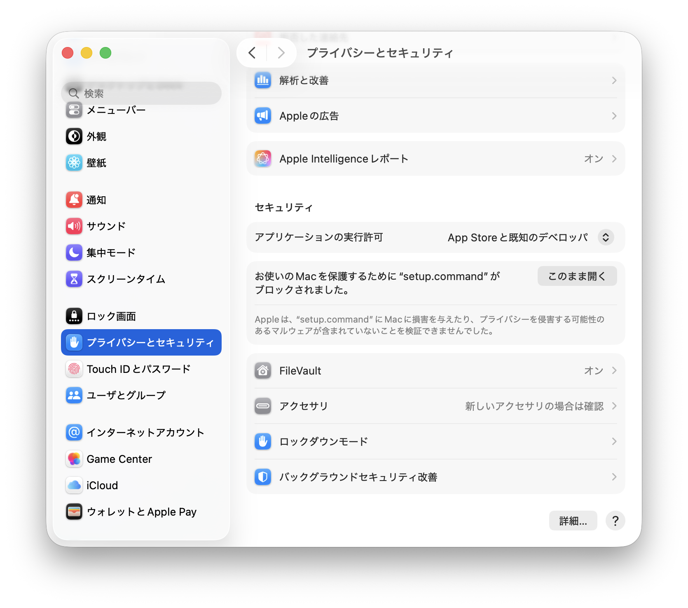

# かんたんセットアップガイド

[English](./quick-start.en.md) | [Tiếng Việt](./quick-start.vi.md)

エンジニアでなくても大丈夫！このガイドに沿って進めれば、AIコーディングアシスタント（Claude Code）をすぐに使い始められます。

## 方法A: セットアップスクリプト（おすすめ）

**所要時間：5〜10分**

ファイルをダブルクリックするだけでセットアップが完了します。ターミナル（黒い画面）の知識は不要です。

### Step 1: コードをダウンロードする

以下のリンクをクリックして、ZIPファイルをダウンロードしてください：

👉 [**ZIPファイルをダウンロード**](https://github.com/sun-asterisk-internal/sun-nextjs-template/archive/refs/heads/main.zip)

> リンクがうまくいかない場合は、[リポジトリのページ](https://github.com/sun-asterisk-internal/sun-nextjs-template) を開き、緑色の「Code」ボタン →「Download ZIP」からダウンロードできます。

#### ダウンロードしたらやること

1. ダウンロードしたZIPファイルを**ダブルクリック**して展開（解凍）します
2. 展開されたフォルダを、好きな場所に移動してください（デスクトップや書類フォルダなど、どこでもOKです）

> 💡 **フォルダ名を変えたい場合**: フォルダ名がプロジェクトの名前になります。自由に変更してOKです（例：`my-project`、`todo-app` など）。ただし、**日本語や空白（スペース）は使わないで**ください。半角英数字とハイフン（`-`）だけを使うのがおすすめです。
>
> - ⭕ 良い例: `my-project`、`todo-app`、`company-website`
> - ❌ 悪い例: `マイプロジェクト`、`my project`（スペースあり）

### Step 2: セットアップスクリプトを実行する

展開したフォルダを開いて、以下のファイルを**ダブルクリック**してください：

| OS | ダブルクリックするファイル |
|----|------------------------|
| Mac | `setup.command` |
| Windows | `setup.bat` |

> **Mac で「マルウェアが含まれていないことを検証できません」や「開発元が未確認」と表示された場合**:
> 1. 警告が表示されたら、そのまま**「OK」**をクリックして閉じます
> 2. **システム設定**（画面左上の  → システム設定）を開きます
> 3. **「プライバシーとセキュリティ」**をクリックします
> 4. 画面を下にスクロールすると、「"setup.command"がブロックされました」というメッセージが表示されています
> 5. **「このまま開く」**をクリックします
> 6. 確認ダイアログが表示されたら、Mac のパスワードを入力して許可します
>
> 
>
> これは macOS のセキュリティ機能（Gatekeeper）で、インターネットからダウンロードしたファイルを初めて開くときに表示される警告です。問題ありませんので安心してください。

#### 画面の案内に従って進める

ダブルクリックすると、黒い画面（ターミナル）が自動で開き、以下のような案内が表示されます：

```
🎉 Sun* Next.js テンプレート セットアップ
━━━━━━━━━━━━━━━━━━━━━━━━━━━━━━━━━━━━━━

  どこまでセットアップしますか？

    1. Claude Code だけ使いたい
       AIに話しかけてコードを書いてもらえるようになります

    2. アプリも作りたい
       上に加えて、アプリの開発をすぐに始められます

  番号を入力してください（1 または 2）:
```

**番号を入力して Enter（Return）キーを押す**だけで、必要なツールが自動でインストールされます。

| コース | 何がインストールされる？ | こんな人におすすめ |
|--------|----------------------|-------------------|
| 1 | Bun + Claude Code | まず Claude Code だけ試してみたい人 |
| 2 | 上記 + アプリの部品一式 | すぐにアプリを作り始めたい人 |

セットアップの最後に **「GitHub CLI もセットアップしますか？」** と聞かれます。チームでコードを共有する予定がある場合は「1」を選んでください。あとからでもセットアップできるので、分からなければスキップしてOKです。

> ⚠️ **GitHub CLI のインストールで Homebrew が必要になった場合**: Homebrew のインストール中に **Mac のパスワード**を求められます。また、新しい Mac では **コマンドラインツール（Xcode Command Line Tools）** のインストールが自動的に始まることがあり、**10〜30分ほど時間がかかる**場合があります。途中で止まったように見えても、処理は進んでいますので、そのままお待ちください。

> 💡 **用語解説 — セットアップスクリプトが行うこと**:
> - **Bun（バン）** — プロジェクトに必要な「部品」をまとめて管理するツール。裏方で動くものなので、直接使うことはほとんどありません
> - **Claude Code** — AIコーディングアシスタント。「Todoアプリを作って」のように自然な言葉で話しかけるだけで、コードを書いてくれます
> - **依存パッケージ（コース2のみ）** — アプリを動かすために必要な部品のセット。料理でいうと「材料」にあたるものです
> - **GitHub CLI（オプション）** — GitHub（コードの共有・管理プラットフォーム）をターミナルから操作するためのツール。チーム開発で使います

> 💡 **パスワードを求められたら？**: Mac の場合、途中でパスワードの入力を求められることがあります。これは Mac にログインするときのパスワードです。入力中は画面に何も表示されませんが、ちゃんと入力されています。打ち終わったら Enter を押してください。

> **Windows をお使いの方へ — Git のセットアップ**: Windows では Git が別途必要です。チームでの共同開発を行う場合は、方法Bの「Step 0: ツールのインストール」にある Git のセットアップを行ってください。Mac では Git は最初から使えるため、この手順は不要です。

### Step 3: Claude Code を使ってみよう

セットアップが完了したら、**このウィンドウを閉じて**、新しいターミナルウィンドウを開いてください（インストールしたツールを使うには、新しいターミナルが必要です）。

**ターミナル**を開いて以下の操作を行ってください：

> 💡 **「ターミナル」って何？** パソコンに文字で命令を出すためのアプリです。
> - **Mac**: `Command（⌘）+ Space` を押して「ターミナル」と入力 → 表示されたアプリを開く
> - **Windows**: スタートメニューで「PowerShell」と検索 → 表示されたアプリを開く

1. ターミナルに `cd ` （cdのあとに半角スペース）と入力します
2. 展開したプロジェクトのフォルダを、ターミナルの画面に**ドラッグ＆ドロップ**します（フォルダの場所が自動入力されます）
3. Enter を押します
4. `claude` と入力して Enter を押します

#### 初回ログイン

初めて Claude Code を起動すると、ブラウザが自動で開いてログイン画面が表示されます。Claude のアカウント（Pro / Max / Teams / Enterprise のいずれか）でログインしてください。

#### 話しかけてみよう

Claude Code が起動したら、作りたいものを**自分の言葉**で伝えてみましょう。専門用語は不要です！

**例1: やりたいことをそのまま伝える**

```
シンプルなTodoアプリを作ってください。
タスクの追加、完了チェック、削除ができるようにしてください。
```

**例2: 要求をファイルに書いて渡す**

作りたいものが複雑な場合は、要求を markdown ファイルに書いて `docs/` フォルダに置き、Claude Code に読んでもらう方法がおすすめです。

まず `docs/requirements.md` のようなファイルを作ります（ファイル名は自由です）：

```markdown
# ユーザー管理画面の要件

## 機能
- ユーザー一覧を表形式で表示する
- 名前・メールアドレスで検索できる
- 新規ユーザーを追加できる
- ユーザー情報を編集・削除できる

## デザイン
- シンプルで見やすいデザイン
- スマホでも使えるようにする
```

そして Claude Code に以下のように伝えます：

```
docs/requirements.md に書いた要件を読んで、その通りに実装してください。
```

> 💡 こうすると Claude Code が要件を正確に理解してくれるので、複雑なものを作るときにとても便利です。

**例3: その他いろいろ頼めます**

```
トップページの見出しを「My Project」に変更してください
```

```
アプリ全体の配色をダークモードに変更してください
```

```
このプロジェクトの構成を教えてください
```

```
ボタンをクリックしたらメッセージが表示されるようにしてください
```

#### 作ったアプリを見るには（コース2を選んだ方）

別のターミナルウィンドウを開いて、同じようにプロジェクトフォルダに移動してから以下を実行します：

```bash
bun run dev
```

その後、ブラウザで [http://localhost:3000](http://localhost:3000) を開くとアプリが表示されます。

> 💡 `localhost:3000` とは、自分のパソコンの中だけで動いているアプリの住所です。インターネット上には公開されていないので安心してください。

---

## 追加設定（オプション）

必要に応じて、以下の設定を行ってください。あとからいつでもセットアップできます。

### GitHub CLI のログイン

セットアップスクリプトで GitHub CLI をインストールした場合は、使い始める前にログインが必要です。ターミナルで以下のコマンドを実行してください：

```bash
# GitHub にログインします
gh auth login -h github.com -p ssh -w
```

実行すると、以下のような表示が出ます：

1. **ワンタイムコード**（例：`AB12-3CD4`）が表示されます — これをコピーしてください
2. Enter を押すとブラウザが開きます
3. ブラウザで GitHub にログインし、ワンタイムコードを貼り付けて認証を完了します
4. SSH鍵に関する質問が表示されたら、案内に従ってください

> **SSO認証（Sun* 組織メンバーの場合）**: 認証後に GitHub の [SSH Keys 設定ページ](https://github.com/settings/keys) を開き、SSH鍵の横にある「Configure SSO」→「sun-asterisk-internal」の「Authorize」をクリックしてください。

### Figma 連携の設定

このテンプレートには Figma MCP（Figma のデザインデータを Claude Code から直接読み取れる連携機能）があらかじめ設定されています。Figma のデザインを元に画面を作りたい場合は、以下の手順で認証を行ってください。

1. Claude Code を起動した状態で `/mcp` と入力して Enter を押します
2. `figma · △ needs authentication` と表示されている場合、矢印キーで選択して Enter を押します
3. 「authenticate」を選択して Enter を押します
4. ブラウザが開くので、Figma アカウントで認証を完了してください

認証が完了すると、Claude Code から Figma のデザインデータにアクセスできるようになります。「Figma のこのデザインを再現して」のように指示するだけで、デザイン通りの画面を作ってくれます。

---

## よくある質問（FAQ）

### セットアップ中の問題

<details>
<summary>「インターネットに接続されていない」というエラーが出た</summary>

Wi-Fi や有線LANの接続を確認してください。VPN を使っている場合は、一度 VPN を切ってから再度試してみてください。
</details>

<details>
<summary>Mac で setup.command が開けない / 「マルウェアが含まれていないことを検証できません」と表示される</summary>

macOS のセキュリティ機能（Gatekeeper）によるブロックです。以下の手順で許可してください：

1. 警告ダイアログが表示されたら**「OK」**をクリックして閉じます
2. **システム設定**（画面左上の  → システム設定）を開きます
3. **「プライバシーとセキュリティ」**をクリックします
4. 画面を下にスクロールすると「"setup.command"がブロックされました」と表示されています
5. **「このまま開く」**をクリックします
6. Mac のパスワードを入力して許可します


上記でもうまくいかない場合は、ターミナルから直接実行する方法もあります：

1. **ターミナル**を開きます（`Command（⌘）+ Space` →「ターミナル」と入力して開く）
2. 開いたターミナルの画面に、`setup.command` ファイルを**ドラッグ＆ドロップ**します
3. Enter を押します

これでセットアップが始まります。
</details>

<details>
<summary>Windows で「このアプリは保護されています」と表示される</summary>

「詳細情報」をクリックしてから「実行」をクリックしてください。Windows Defender SmartScreen による警告で、初めて実行するスクリプトに対して表示されるものです。
</details>

<details>
<summary>セットアップが途中で止まった / 失敗した</summary>

もう一度 `setup.command`（Mac）または `setup.bat`（Windows）をダブルクリックして再実行してください。すでにインストール済みのツールは自動でスキップされるため、途中から再開できます。
</details>

### Claude Code の使い方

<details>
<summary>Claude Code が起動しない / 「command not found」と表示される</summary>

ターミナルを一度閉じてから、新しいターミナルウィンドウを開いて `claude` と入力してみてください。それでもダメな場合は、セットアップスクリプトをもう一度実行してください。
</details>

<details>
<summary>Claude Code にログインできない</summary>

Claude Code を使うには、[Claude Pro / Max / Teams / Enterprise](https://claude.com/pricing) のいずれかの有料アカウントが必要です。無料プランでは使えません。アカウントをお持ちでない場合は、まずアカウントを作成してください。
</details>

<details>
<summary>Claude Code を終了するには？</summary>

`/exit` と入力するか、`Ctrl + C` を2回押すと終了できます。
</details>

### アプリの開発

<details>
<summary>http://localhost:3000 を開いても何も表示されない</summary>

`bun run dev` が実行中であることを確認してください。ターミナルに「Ready」や「started server」のようなメッセージが表示されていれば、サーバーは起動しています。表示されていない場合は、もう一度 `bun run dev` を実行してください。
</details>

<details>
<summary>アプリの開発サーバーを止めるには？</summary>

`bun run dev` を実行しているターミナルで `Ctrl + C` を押すと停止します。
</details>

---

困ったことや分からないことがあれば、チームのメンバーや Kazuma Endo ([Slack](https://sun-asterisk.enterprise.slack.com/team/U033CJYTVAQ)) に気軽に相談してください。

---

## 方法B: 手動セットアップ

ターミナルにコマンドを入力してセットアップする方法です。Git/GitHub連携も含まれるため、チーム開発を行う場合はこちらがおすすめです。方法Aでセットアップ済みの方も、Git/GitHub連携が必要になったら「Step 0」のGit・GitHub CLIの部分だけ実施すればOKです。

### Step 0: ツールのインストール

以下のツールをインストールします。それぞれが何をするものかも説明しているので、参考にしてください。

#### Bun のインストール

> **Bun とは？** JavaScript/TypeScript のパッケージマネージャー兼ランタイムです。プロジェクトに必要なライブラリのインストールや、開発サーバーの起動に使います。

**Mac / Linux**:
```bash
# Bun をインストールします
curl -fsSL https://bun.com/install | bash
```

**Windows**:
```powershell
# Bun をインストールします
powershell -c "irm bun.sh/install.ps1 | iex"
```

インストール後、ターミナルを一度閉じて開き直してください。

#### Git のインストール

> **Git とは？** コードの変更履歴を管理するツールです。チームで同じコードを編集するときに、誰がいつ何を変更したかを記録・共有できます。

```bash
# Git がインストール済みか確認します
git --version
```

バージョン番号が表示されない場合：
- **Mac**: 上のコマンドを実行すると自動でインストールダイアログが出ます
- **Windows**: [git-scm.com](https://git-scm.com/downloads/win) からダウンロード

#### GitHub CLI のインストール

> **GitHub CLI とは？** GitHub（コードの共有・管理プラットフォーム）をターミナルから操作するためのツールです。コードのダウンロードやプルリクエストの作成などに使います。

**Mac（方法①：Homebrew を使う場合 — おすすめ）**:

> 💡 **Homebrew（ホームブルー）とは？** Mac 用のパッケージマネージャーです。ツールのインストール・アップデートをコマンド1つで行えます。すでにインストール済みの方、またはこれからインストールしてもよい方はこちらが簡単です。

```bash
# Homebrew が未インストールの場合は、まずこちらでインストールします
/bin/bash -c "$(curl -fsSL https://raw.githubusercontent.com/Homebrew/install/HEAD/install.sh)"
```

> ⚠️ **Homebrew インストール時の注意**: インストール中に **Mac のパスワード**を求められます。また、新しい Mac では**コマンドラインツール（Xcode Command Line Tools）**のインストールが自動的に始まることがあり、**10〜30分ほど時間がかかる**場合があります。途中で止まったように見えても、処理は進んでいますので、そのままお待ちください。

> ⚠️ **Homebrew インストール後の重要な手順**: インストールが完了すると、画面に **「Next steps」** として3行のコマンドが表示されます。これを**1行ずつコピー＆ペーストして実行**してください。この手順を行わないと `brew` コマンドが使えません。
>
> 表示される内容の例（Apple Silicon Mac の場合）：
> ```
> echo >> ~/.zprofile
> echo 'eval "$(/opt/homebrew/bin/brew shellenv)"' >> ~/.zprofile
> eval "$(/opt/homebrew/bin/brew shellenv)"
> ```
> ※ お使いの Mac によって表示内容が少し異なる場合がありますが、画面に表示されたものをそのまま実行すればOKです。

```bash
# GitHub CLI をインストールします
brew install gh
```

**Mac（方法②：ZIP ファイルからインストールする場合）**:

[GitHub CLI 公式ページ](https://cli.github.com/) から ZIP ファイルをダウンロードし、ダブルクリックで展開してから、以下のコマンドでインストールします：

```bash
# ダウンロードした gh コマンドをインストールします（パスワードを求められます）
sudo cp ~/Downloads/gh_*_macOS_*/bin/gh /usr/local/bin/
```

**Windows**: [GitHub CLI 公式ページ](https://cli.github.com/) から MSI インストーラーをダウンロードして実行してください。

インストールしたら、ログインします：

```bash
# GitHub にログインします（ブラウザが開きます）
gh auth login -h github.com -p ssh -w
```

ブラウザが開くので、画面の指示に従って認証してください。その後、SSH鍵に関する質問が表示されたら案内に従ってください。

> **SSO認証（Sun* 組織メンバーの場合）**: 認証後に GitHub の [SSH Keys 設定ページ](https://github.com/settings/keys) を開き、SSH鍵の横にある「Configure SSO」→「sun-asterisk-internal」の「Authorize」をクリックしてください。

#### Claude Code のインストール

> **Claude Code とは？** AIコーディングアシスタントです。自然な言葉で指示するだけでコードの作成・修正を行えます。

**Mac / Linux**:
```bash
# Claude Code をインストールします
curl -fsSL https://claude.ai/install.sh | bash
```

**Windows PowerShell**:
```powershell
# Claude Code をインストールします
irm https://claude.ai/install.ps1 | iex
```

### Step 1: コードの取得

```bash
# GitHub からテンプレートをコピーして、my-project というフォルダに保存します
gh repo clone sun-asterisk-internal/sun-nextjs-template my-project

# 作成したフォルダに移動します
cd my-project
```

> `my-project` の部分は好きなプロジェクト名に変更できます（例：`todo-app`、`my-website` など）

### Step 2: セットアップ

```bash
# プロジェクトに必要なライブラリをまとめてインストールします
bun install
```

### Step 3: Claude Code を起動

```bash
# Claude Code を起動します
claude
```

初回起動時はログインが求められます。[Claude Pro / Max / Teams / Enterprise](https://claude.com/pricing) のいずれかのアカウントが必要です。
