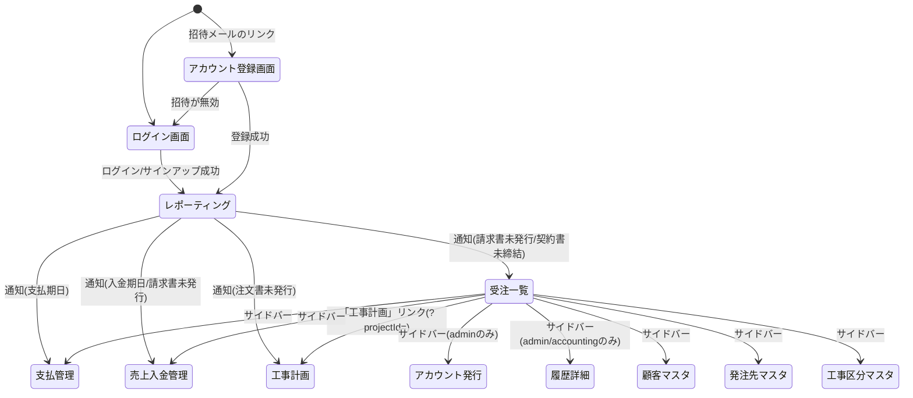

# 画面仕様書: construct-pro-next（全画面移行）

本書は `requirements-state.json` の生きている `confirmed_items` から `screen-specification-orchestrator` が導出した12画面の仕様書である。対応する機械可読ファイルは `screens.json`（本書と同じ画面境界・`depends_on` を共有する単一の正）。

内容は旧app（`~/construct-pro`）の実装を一次情報として詳細調査した上での「現状の挙動をどこまで移植し、どこを直すか」という編集判断込みの仕様であり、新規デザインの提案ではない。個別の判断根拠は `requirements-state.json` の各 `confirmed_summary` を参照。

## 画面遷移図



サイドバーからは受注一覧・工事計画・顧客マスタ・発注先マスタ・工事区分マスタ・売上入金管理・支払管理・レポーティングへ相互に遷移できる（上図では受注一覧起点のみ代表して図示、実際は全画面間で相互リンクする水平ナビゲーション）。履歴詳細はadmin/accountingのみ、アカウント発行はadminのみサイドバーに表示される。

## 画面一覧

| 画面名 | URL | 概要 |
|---|---|---|
| ログイン／サインアップ | `/login` | メール+パスワード認証。サインアップは簡易自己登録（role固定） |
| アカウント発行 | `/invite`（admin限定） | 招待の発行・一覧・アカウント管理 |
| アカウント登録（招待受諾） | `/accept-invite` | 招待トークン検証とパスワード設定 |
| 顧客マスタ | `/customers` | 顧客企業のCRUD |
| 工事区分マスタ | `/categories` | 工事区分コードのCRUD |
| 発注先マスタ | `/vendors` | 発注先企業・口座情報のCRUD |
| 履歴詳細 | `/history`（admin/accounting限定） | 監査ログの閲覧 |
| 売上・入金管理 | `/receipts` | 案件別入金の管理、案件外入金 |
| 支払管理 | `/payment` | 発注先への支払の管理、工事外支払 |
| レポーティング | `/reporting` | ログイン後の着地ページ。経営ダッシュボード＋通知ベル |
| 工事計画 | `/orders-list` | 案件配下の発注明細管理、発注書PDF/メール |
| 受注一覧 | `/projects` | 案件マスタ兼進行管理。見積書PDF/メール、引渡月変更複製 |

各画面とも旧appの実装がそうであったように、一覧＋モーダル（または一覧＋インライン編集）の単一ページ構成であり、「一覧」「詳細」を別ルートに分割しない（`screen-specification-orchestrator` の導出において、`confirmed_items` の `confirmed_summary` がいずれもモーダル/インライン編集による単一画面内完結を明示しているため）。

---

## 画面詳細

### ログイン／サインアップ画面

- **URL**: `/login`
- **目的**: メールアドレス／パスワードでシステムにログインする。新規ユーザーの簡易自己登録も同画面で行う。
- **ワイヤーフレーム**:
```
┌───────────────────────────────┐
│         [ロゴ] デモ画面          │
├───────────────────────────────┤
│  メールアドレス [____________]  │
│  パスワード     [____________]  │
│  [エラーメッセージ]              │
│           [ ログイン ]           │
│         新規登録はこちら          │
└───────────────────────────────┘
```
サインアップビューはフォーム内容が異なるのみで同一レイアウト（お名前・メール・パスワード・確認用）。
- **表示要素**: ロゴ、ログイン/サインアップの切替ビュー、フォーム、エラー表示領域
- **インタラクション**: フォーム送信→cookie発行→`/reporting`へ遷移。ビュー切替はページ遷移なし
- **状態バリエーション**:
  - Empty: 初期表示（ログインビュー）
  - Loading: 送信中はボタンをdisabled
  - Error: 認証失敗・レートリミット超過・アカウント停止/削除の各メッセージをフォーム内に表示
  - Populated: 該当なし（フォーム画面のため）
- **レスポンシブ**: 単一カラム、モバイルでも同一レイアウトで幅のみ縮小
- **使用コンポーネント**: `<Card>` `<Input>` `<Label>` `<Button>` `<Alert>`（エラー表示）

### アカウント発行画面

- **URL**: `/invite`（adminのみ、他ロールはアクセス不可）
- **目的**: 管理者が新規ユーザーへ招待を発行し、発行済み招待・登録済みアカウントを管理する。
- **ワイヤーフレーム**:
```
┌─────────────────────────────────────────────┐
│ アカウント発行                                  │
├───────────────┬─────────────────────────────┤
│ 招待発行フォーム   │ 発行済み招待テーブル             │
│  氏名 [______]  │  メール|権限|状態|期限|操作         │
│  メール[______] │                              │
│  権限 ○admin    │                              │
│      ○accounting│                              │
│      ●staff      │                              │
│  [招待メールを送信]│                              │
├───────────────┴─────────────────────────────┤
│ 登録済みアカウントテーブル                          │
│  氏名/メール|権限(select)|ステータス|登録日|操作      │
└─────────────────────────────────────────────┘
```
- **表示要素**: 招待発行フォーム、発行済み招待テーブル、登録済みアカウントテーブル
- **インタラクション**: 招待送信（実際にメール送信、旧appの「準備中」スタブを再現しない）、招待取消、ロール変更、一時停止/有効化、削除。自分自身の行は操作不可
- **状態バリエーション**:
  - Empty: 「発行済みの招待はありません」「登録済みのアカウントがありません」
  - Loading: テーブル読み込み中のスケルトン
  - Error: 「読み込みエラー」、メール送信失敗時のインラインエラー
  - Populated: 通常のテーブル表示
- **レスポンシブ**: デスクトップ優先の管理画面、モバイルではテーブルを横スクロール
- **使用コンポーネント**: `<Card>` `<Input>` `<Label>` `<Button>` `<Select>`（新規追加が必要: `<Table>` `<RadioGroup>` `<AlertDialog>`（削除確認））

### アカウント登録（招待受諾）画面

- **URL**: `/accept-invite?token=xxx`
- **目的**: 招待リンクを開いたユーザーがパスワードを設定し本登録する。
- **ワイヤーフレーム**:
```
┌───────────────────────────────┐
│         [ロゴ] デモ画面          │
├───────────────────────────────┤
│  メール: xxx@example.com（表示のみ）│
│  氏名: 山田太郎（表示のみ）        │
│  権限: 一般社員（表示のみ）        │
│  パスワード      [____________]  │
│  パスワード確認   [____________]  │
│         [ 登録してログイン ]      │
└───────────────────────────────┘
```
無効時は別ビュー: 理由メッセージ＋「ログイン画面へ」ボタン。
- **表示要素**: 招待内容の読み取り専用表示、パスワード設定フォーム
- **インタラクション**: 送信→cookie発行→`/reporting`へ遷移
- **状態バリエーション**:
  - Loading: 「招待を確認しています...」スピナー
  - Error: 無効理由別メッセージ（見つからない/期限切れ/使用済み/トークン欠落）
  - Populated: 招待有効時のパスワード設定フォーム
- **レスポンシブ**: 単一カラム
- **使用コンポーネント**: `<Card>` `<Input>` `<Label>` `<Button>` `<Alert>`

### 顧客マスタ

- **URL**: `/customers`
- **目的**: 案件相手方となる顧客企業の基本情報を管理する。
- **表示要素**: 検索ボックス、一覧テーブル（企業名・部門・担当者・連絡先・住所・資本金・企業規模・サイト）、新規登録モーダル、編集モーダル
- **インタラクション**: 行クリックで編集モーダル、新規登録ボタンでモーダル、編集モーダル内から削除（ソフトデリート、confirm確認）
- **状態バリエーション**:
  - Empty: 「顧客が登録されていません」
  - Loading: テーブルスケルトン
  - Error: 保存/削除失敗時のトースト
  - Populated: 通常のテーブル表示
- **レスポンシブ**: テーブルは横スクロール対応
- **使用コンポーネント**: `<Card>` `<Input>` `<Button>`（新規追加が必要: `<Table>` `<Dialog>`）

### 工事区分マスタ

- **URL**: `/categories`
- **目的**: 発注（工事計画）の分類コード体系を管理する。
- **表示要素**: 検索ボックス、一覧テーブル（コード・名称・表示順・備考）、新規登録モーダル（コード自動採番）、編集モーダル
- **インタラクション**: 行クリックで編集、新規登録、編集モーダル内から**物理削除**（confirm確認）
- **状態バリエーション**: Empty/Loading/Error/Populated は顧客マスタと同様
- **使用コンポーネント**: `<Card>` `<Input>` `<Button>`（新規追加が必要: `<Table>` `<Dialog>` `<AlertDialog>`）

### 発注先マスタ

- **URL**: `/vendors`
- **目的**: 発注先（協力会社）の企業情報と振込先口座情報を管理する。
- **表示要素**: 検索ボックス、一覧テーブル（口座番号は含まない）、対応工事区分タグ、新規登録/編集モーダル（振込先口座情報含む）
- **インタラクション**: 行クリック→個別取得APIで口座フル値を再取得してから編集モーダルを開く（一覧のマスク値をそのまま再送信する事故を防ぐ）、新規登録、削除（ソフトデリート）
- **状態バリエーション**: Empty/Loading/Error/Populated
- **使用コンポーネント**: `<Card>` `<Input>` `<Button>` `<Badge>`（工事区分タグ）（新規追加が必要: `<Table>` `<Dialog>`）

### 履歴詳細（監査ログ）

- **URL**: `/history`（admin/accounting限定）
- **目的**: マスタ・トランザクションデータへの操作履歴を閲覧する。
- **表示要素**: 対象画面フィルタ、操作フィルタ、監査ログ一覧テーブル（日時・操作バッジ・対象・変更内容・操作者）
- **インタラクション**: フィルタ変更で再取得/再フィルタ。読み取り専用（作成・編集・削除なし）
- **状態バリエーション**:
  - Empty: 「履歴がありません」
  - Loading: テーブルスケルトン
  - Error: 「読み込みエラー」
  - Populated: 通常表示
- **使用コンポーネント**: `<Card>` `<Select>` `<Badge>`（操作種別）（新規追加が必要: `<Table>`）

### 売上・入金管理

- **URL**: `/receipts`
- **目的**: 案件ごとの入金実績を管理し、案件に紐づかない入金/返金も扱う。
- **表示要素**: 案件／案件外タブ、サマリーカード3枚、フィルタ、案件一覧テーブル（行内インライン編集）、入金登録モーダル、消し込み履歴モーダル、案件外入金モーダル、CSV出力ボタン
- **インタラクション**: ステータス・備考は行内で即時保存、入金登録はモーダル経由、通知の`?q=`で検索欄を自動絞り込み
- **状態バリエーション**: Empty/Loading/Error/Populated（フィルタ結果0件時のEmpty State含む）
- **使用コンポーネント**: `<Card>` `<Select>` `<Input>` `<Button>`（新規追加が必要: `<Table>` `<Tabs>` `<Dialog>`）

### 支払管理

- **URL**: `/payment`
- **目的**: 発注先への支払状況を管理し、工事外の支払/返金も扱う。
- **表示要素**: 工事支払／工事外タブ、フィルタ、支払一覧テーブル（期日超過/接近の強調）、支払登録モーダル、支払履歴モーダル、工事外支払モーダル、CSV出力ボタン
- **インタラクション**: 支払登録・取消はadmin/accountingのみ（他ロールにはボタン非表示）、ステータス・備考の行内編集（version付きで楽観ロック）、通知の`?q=`連携
- **状態バリエーション**: Empty/Loading/Error/Populated
- **使用コンポーネント**: `<Card>` `<Select>` `<Input>` `<Button>` `<Badge>`（期日警告）（新規追加が必要: `<Table>` `<Tabs>` `<Dialog>`）

### レポーティング（ダッシュボード）

- **URL**: `/reporting`
- **目的**: ログイン後の着地ページとして経営指標を可視化し、通知ベルから他画面への導線を提供する。
- **表示要素**: 3タブ（予実・残高/レポート分析/企業別発注金額一覧）、サマリーカード群、グラフ、通知ベル
- **インタラクション**: タブ切替、期間フィルタ、PDF出力（推移グラフ）、通知確認（クライアント側既読管理）
- **状態バリエーション**: Empty（データ無し月）/Loading/Error/Populated
- **使用コンポーネント**: `<Card>` `<Badge>`（発注偏りアラート）（新規追加が必要: `<Tabs>` グラフ描画ライブラリ）

### 工事計画

- **URL**: `/orders-list`（`?projectId=`クエリで案件選択ビュー/明細ビューを切替）
- **目的**: 案件配下の発注明細を管理し、発注書PDF発行・発注確定メール送信を行う。
- **ワイヤーフレーム（明細ビュー、編集モーダル展開時）**:
```
┌─────────────────────────────────────────┐
│ 工事計画                     [CSV出力][新規] │
│ フィルタ: 工事区分 ステータス キーワード          │
├─────────────────────────────────────────┤
│ 工事区分|発注先|見積額|予定|決定|状態|注文書  │
├─────────────────────────────────────────┤
│        ╔═══ 注文詳細の編集 ═══╗            │
│        ║ 工事区分* [______]   ║            │
│        ║ 発注先    [______]   ║ (フローティング│
│        ║ 決定金額  [______]   ║  モーダル)   │
│        ║ ステータス [______]  ║            │
│        ║ [削除] [キャンセル][保存]║          │
│        ╚═════════════════════╝            │
└─────────────────────────────────────────┘
```
- **表示要素**: 案件選択ビュー、明細ビュー（サマリーカード4枚、テーブル）、編集フローティングモーダル、注文書プレビューモーダル、発注確定メール送信パネル、請書/請求書PDFアップロード
- **インタラクション**: 行クリックでモーダル、注文書プレビューで工事ID自動採番、メール送信（実送信）、楽観ロック（409時アラート）
- **状態バリエーション**: Empty/Loading/Error/Populated、モーダル開閉の各状態
- **使用コンポーネント**: `<Card>` `<Select>` `<Input>` `<Button>` `<Badge>`（新規追加が必要: `<Table>` `<Dialog>`（フローティングモーダル） `<Popover>`（メール送信パネル））

### 受注一覧

- **URL**: `/projects`
- **目的**: 案件（受注）の一覧管理・ステータス管理・見積書発行を行う、本システムの中核画面。
- **ワイヤーフレーム（インライン編集行）**:
```
┌───────────────────────────────────────────┐
│ 受注一覧                          [新規案件登録] │
│ フィルタ: ステータス 工期範囲                     │
├───────────────────────────────────────────┤
│ 案件ID|工事名|発注元|工期|引渡月|契約金額|状態|工事計画│
├───────────────────────────────────────────┤
│ WW-202608-001│ビル改修│田中様│…│受注(select)│…  │←通常行
│[工事名____][発注元____][契約金額____][保存][キャンセル]│←編集行(該当行のみ差替)
└───────────────────────────────────────────┘
```
- **表示要素**: 一覧テーブル、インライン編集行、新規案件登録モーダル、見積書プレビューモーダル
- **インタラクション**: 行クリックでインライン編集切替、ステータスは常時行内select、見積書送信（実送信）、引渡月変更時は確認ダイアログ→複製API、工事計画へのリンク
- **状態バリエーション**: Empty/Loading/Error/Populated、オーダー移行済み行のロック表示（グレーアウト）
- **使用コンポーネント**: `<Card>` `<Select>` `<Input>` `<Button>` `<Badge>`（ステータス）（新規追加が必要: `<Table>` `<Dialog>`（新規登録・見積書プレビュー） `<AlertDialog>`（引渡月変更確認））

---

## デザインシステム接続まとめ

現時点で `src/components/ui/` に存在するのは `alert` `badge` `button` `card` `input` `label` `select` のみ。全12画面が共通して必要とする以下のコンポーネントは、`prototype-builder`（Task 9）実行前に `shadcn` スキル経由で追加する必要がある：

- `<Table>`（全12画面）
- `<Dialog>`（モーダル方式を採る11画面。受注一覧・工事計画のみ独自のフローティングモーダル/インライン編集だが、新規登録・見積書/注文書プレビューは`<Dialog>`で実装可能）
- `<Tabs>`（売上・入金管理、支払管理、レポーティング）
- `<AlertDialog>`（削除確認、引渡月変更確認）
- `<RadioGroup>`（アカウント発行の権限選択）
- `<Popover>`（工事計画のメール送信パネル）

## 次のステップ

- 画面を実装する → `prototype-builder`（Phase 6）
- 影響分析を行う → 不要（旧appからの1:1移行のため対象範囲は`requirements-state.json`で確定済み）
